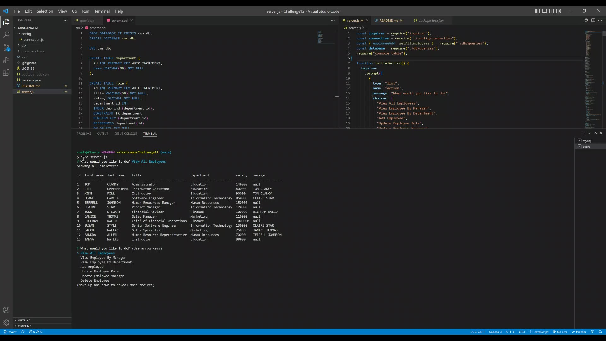

# Employee Tracker(SQL)

[](https://opensource.org/licenses/ISC)

## Table Of Contents

- [Motivation](#Motivation)
- [Tools-Utilized](#Tools-Utilized)
- [Installation](#Installation)
- [Usage](#Usage)
- [License](#License)
- [Contribution](#Contribution)
- [Tests](#Tests)
- [Questions](#Questions)
- [Credits](#Credits)

## Motivation

The motivation for this project is to provide users with a convenient and efficient way to store/update/add/delete products in their database. The goal is to build a command-line application from scratch to manage a company's employee database, using Node.js, Inquirer, and MySQL.

In completing this project, I have learned the basic concepts of MySQL, Inquirer, and Node.js. I have also learned the benefits of utilizing modular routes to maintain cleaner code.



## Video Demonstration

Link to video demonstration here: [EmployeeTrackerAppDemo](https://drive.google.com/file/d/1zkzeEhxCYRrQ4fCna2anBkIrTMuVAvqe/view?usp=share_link)

## Tools Utilized


## Installation

You’ll need to install [Node.js](https://nodejs.org/en/), [MySQL2 package](https://www.npmjs.com/package/mysql2), [Inquirer package](https://www.npmjs.com/package/inquirer/v/8.2.4), [console.table package](https://www.npmjs.com/package/console.table), and [dotenv](https://www.npmjs.com/package/dotenv).
## Usage

User will fork or download code and open in text editor of their choice. User will connect to database through command-line terminal and type command ```mysql -u root -p``` then type in password if user has one. Then the schema file should be run ``SOURCE schema.sql`` as well as seeds file ``SOURCE seeds.sql``. User can then exit MySQL in terminal through command `quit`.Close terminal and open another integrated terminal, run command ``npm install`` and check that all packages are installed. User then can run ``node server.js`` and will be prompted with a variety of options. Follow the prompts to interact with the database.

## License

Licensed under the [ISC](https://opensource.org/licenses/ISC) license

## Contribution

Provide any suggestions to the email listed below.

## Tests

To run this application, tests are not required.

## Questions

_Any questions please contact me through email_

cwalk280@yahoo.com

## Credits

Resources of significance:


Special thanks to [Ileriayo Adebiyi](https://github.com/Ileriayo/markdown-badges#testing) and [Lucas Himsel](https://gist.github.com/lukas-h/2a5d00690736b4c3a7ba) for their public library of common badges
